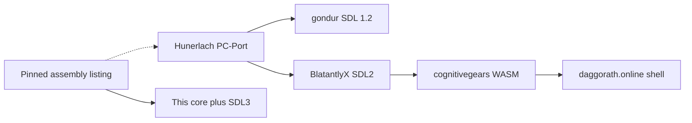

# Port comparison — Hunerlach lineage and this project

Written 2026-09-26. This is a planning note, not a specification and not
evidence. Behavioural claims about the original game stay in the
[clock and scheduler specification](../specification/clock-and-scheduler.md)
and the phase reconciliations. Claims below about the other ports describe
what those trees do; they are not rules for Original Mode.

The three local checkouts are one family. Richard Hunerlach’s Windows C++
PC-Port (about 2002–2003) was packaged for Linux by gondur (SDL 1.2) and
modernized by BlatantlyX (SDL 2). The website then compiles that SDL2 tree
to WebAssembly. None of them keeps the original 60 Hz interrupt scheduler.
This project does, which is why the mobile plan in the
[roadmap](roadmap.md) is the right shape.

Nothing from these trees is imported: no C++, no WAV, no WASM. They are
reference-only until a licence is recorded in the
[provenance ledger](../provenance/ledger.md). The open questions are in
[licensing](../licensing/README.md).

## Pins

Read locally on 2026-09-26. The cognitivegears submodule was not checked out.

| Tree | Remote | Commit | Date | What it is |
|---|---|---|---|---|
| Linux | `gondur/dungeons-of-daggorath` | `4ab53f4` | 2016-04-16 | SDL 1.2 + OpenGL + SDL_mixer packaging of the PC-Port. About 11k lines of C++. |
| SDL2 | `BlatantlyX/DungeonsOfDaggorath` | `8cd3ef8` | 2016-04-19 | Same module set. SDL2 switch is `917410d` (2015-06-05). Version string 0.5.0. |
| Web | `DungeonsOfDaggorath/DungeonsOfDaggorath.github.io` | `d37e0fb` | 2026-01-06 | Jekyll/PWA shell. Site licence MIT. Game is committed `index.wasm` (2,129,838 bytes). Submodule `cognitivegears/DungeonsOfDaggorath` @ `c2bce45` is empty in this checkout. `about.md` says the WASM is the SDL2 port with Emscripten changes. |

## Lineage



The solid arrow is this project’s specification path: the pinned listing at
`a94326f`, then the headless core, then the SDL3 window. The dashed arrow is
the ports’ historical path. Gondur and BlatantlyX share the same source file
set (`sched`, `player`, `creature`, `viewer`, `oslink`, `parser`, `enhanced`,
and the rest). The web shell’s readable code is the page around the blob.
The C++ inside the blob was not read.

## Evidence

This project labels rules source-proven, ROM-observed, inferred, or
unresolved, from the pinned listing and from MAME captures recorded in the
phase reconciliations.

The ports transliterate the game into a set of global objects and then
replace the scheduler. `sched.cpp` in both the Linux and SDL2 trees says the
original scheduling algorithm “has been entirely replaced with a simpler
algorithm” that “uses milliseconds instead of JIFFYs.” Their readme also
says the built-in demo “is not quite timed correctly.” That is a fidelity
gap they recorded and shipped.

## Architecture

Their intended boundary is `OS_Link`: window, audio, and keys in one class.
In practice `dod.h` pulls SDL into nearly every translation unit. Combat,
the heart, and the viewer call `Mix_Playing` and OpenGL directly. A dozen
global singletons (`game`, `player`, `scheduler`, `viewer`, `oslink`, …)
are constructed in `dod.cpp`. `viewer.cpp` is about 2,200 lines and owns
vectors, text, maps, fades, and menus. `viewer.h` calls that class huge and
in need of a split.

This project’s split is the correction, recorded in
[module boundaries](../architecture/module-boundaries.md). `src/core` links
nothing. `src/presentation` projects state and never mutates the core.
`src/platform/sdl_app.cpp` polls keys, calls `advance_jiffies`, and draws
that projection. The same core runs under `dcli` with no window.

That split is what makes Android and iOS packaging a shell around an
already-tested game, which is Phase 9. The ports would have to untangle
SDL from the rules before a second backend could share them.

## Clock

Both desktop ports drive tasks from `SDL_GetTicks()`. `CLOCK` and `PLAYER`
use a period of 17 ms, treated as one jiffy. When the loop is late,
`CLOCK` subtracts `elapsed / 17` from `HEARTC`, capped at `126 * 17`. Late
frames drop heartbeats. They do not replay the missed interrupt laps.
There is no `SDL_Delay` in the main loop, so the scheduler busy-spins.
Many gameplay paths then busy-wait on `Mix_Playing` until a sample ends,
so game time waits on the audio device.

`conf/opts.ini` in both trees, and the copy packed inside the web port’s
`index.data`, sets `creatureSpeed=200`, `moveDelay=500`, `turnDelay=37`,
and `creatureRegen=5`. Those are port pacing knobs. The menu treats 200 as
a “CoCo” creature speed; the code scales move and attack periods by that
multiplier. A default other than the original cadence is easy to ship as
if it were the original.

This project’s rule is in the scheduler specification §12 and deviation
D-10: host microseconds become owed jiffies, and every owed jiffy runs.
`jiffies_due` in `sdl_app.cpp` keeps the remainder, so a stall catches up.
Blocking work that the original did in the foreground is a core `Block`
event ([ADR-0004](../adr/0004-presentation-contract.md)), with a duration
when the listing gives one.

## Input

The Linux and SDL2 ports are keyboard-only for play. Keys go through a
QWERTY or Dvorak table into `parser.KBDPUT`, which is the right idea: one
keyboard buffer, one parser. Around that path they added three side doors.

- Escape opens a meta-menu (file, config, help). The menu pauses the
  simulation by shifting every task’s next timestamp by the time the menu
  was open.
- `SETOPT` / `SO`, `SETCHEAT` / `SC`, and `RESTART` are handled in
  `enhanced.cpp` before the original parser.
- Leaving the map injects a space with `KBDPUT(32)`, commented as a
  “necessary ??? hack.”

The web shell is the input lesson that matters for Phase 8. `manifest.json`
asks for a portrait standalone app. The canvas sits in a 4:3-ish box
(`padding-bottom: 70%`, capped by `max-width: 133vh`) with `touch-action:
none`. After the demo, a button hierarchy sends whole command lines:

```text
Module.ccall('sendinput', 'void', ['string'], [cmd + "\r"]);
```

Top-level verbs (`MOVE`, `TURN`, `ATTACK`, `PULL`, `GET`, `STOW`, `CLIMB`,
`EXAMINE`, `LOOK`, `DROP`, `USE`, `REVEAL`, `INCANT`, `ZSAVE`, `ZLOAD`)
open a second row of modifiers. `MOVE FORWARD` is sent as `MOVE`.
`PULL` and `GET` then ask the game for `|`-separated inventory or floor
names and turn those into buttons. `INCANT` uses a real text field. The
escape menu gets its own pad (`sendkey` with SDL keycodes). Touch targets
on the settings labels are at least 44 px. A “Modern Controls” option maps
arrow keys and Tab; that mapping lives in the C++ blob, not in the page.

That hierarchy matches the contract in
[src/input/README.md](../../src/input/README.md) and the
[Phase 8 prompt](../prompts/phase-8-touch-input.md): every gesture becomes
the command a typist would have entered, and the typed line stays
available. Phase 8 still has to choose whether a gesture emits the whole
line at once or paces keystrokes. The web pad does the former. A finished
line in one delivery can hide the unchecked 32-byte keyboard buffer,
because the original inserts one character per interrupt. If the chosen
adapter differs from a typist, Phase 8 records that as a deviation.

[ADR-0007](../adr/0007-mode-separation.md) already keeps timing-changing
overlays out of Original Mode. The ports’ escape menu, which freezes task
deadlines, is an enhanced-mode idea. Original Mode touch controls operate
while the clock runs, which is what the charter asks for.

## Picture and sound

The ports keep a 256×192 logical space (`Coordinate` in `dod.h`) and scale
it into an OpenGL window. Heights are forced to `width * 0.75`. Menu
resolutions run from 640×480 upward; the packed default width is 1024.
Drawing is immediate-mode `GL_LINES` and `GL_QUADS`. Graphics modes are
`NORMAL` (CoCo-like blocks), `HIRES`, and `VECTOR`. The web shell adds
NTSC, NTSC-inverse, and RGB filters, chosen in the page and passed in with
`applyconfig`. Those are presentation skins. ADR-0007 rule 2 already allows
scaling, line thickness, and volume in any mode, because they do not reach
the core.

Sound is 26 WAV files (`00_squeak` through `19_buzz`), played by SDL_mixer
at 44100 Hz. The heart files are tiny stubs; the heartbeat is still gated
on `Mix_Playing`. There is no synthesis of the CoCo one-bit DAC path.

This project rasterizes `VECTOR`’s DDA onto a 256×192 surface and scales
that for the window (768×576 at 3× in the current desktop app). The
heartbeat is the original one-bit toggle. Other cues are not synthesized
yet; deviation D-10 says so. The next audio work is DAC synthesis from the
`CoreEvent` stream already emitted by the core. The WAV pack stays outside
the repository.

## Save

`ZSAVE` / `ZLOAD` in the ports write `saved/<name>.dod` as one decimal
integer per line: maze cells, player fields, creatures, objects, viewer
state, then an extended block for level seeds, the vertical-feature table,
`RandomMaze`, `ShieldFix`, and the other enhancement flags. Older files
without that block are filled with hard-coded original seeds. The format
is a dump of C++ fields. It is readable, and it is brittle across
compilers and across the extra flags.

The web shell keeps those files alive across reloads by copying `*.dod`
between the Emscripten filesystem and an IndexedDB mount
(`/saved_persistent`) and calling `FS.syncfs`. Settings (graphics, volume,
mods, cheats) live in the URL query string, not in the save.

This project already separates the two ideas the ports mixed together.
[ADR-0005](../adr/0005-save-state-format.md) defines a historical RAM image
(`DAGRAM 1`: the fields inside `DP.BEG`–`MM.END`, including queues, `SEED`,
and the clock) and a suspend snapshot (`DAGSNAP 1`) for process death.
The platform storage envelope is still unimplemented; that is Phase 9.
The web lesson to keep is the persistence itself: app-private storage for
saves, and a snapshot that survives the OS killing a backgrounded app.
The ports never had to decide what backgrounding does. Phase 9 still
records that choice (suspend at the same jiffy, or continue) as a platform
deviation and tests it.

## Fidelity drift

These options ship in the same binary as the “original” path, toggled by
the menu, by `SETOPT` / `SETCHEAT`, or by URL parameters on the website.
Each one changes rules or populations. ADR-0007 and Phase 11 already put
this class of change behind extension points. They are listed here so a
later phase can recognise them, not so they get built.

| Option | What it changes |
|---|---|
| `ShieldFix` | Swaps bronze and leather offence and defence |
| `RandomMaze` | Replaces the five fixed level seeds |
| `creatureSpeed` | Scales creature move and attack periods |
| `creatureRegen` | Menu choices of 1, 3, or 5 minutes |
| Creatures ignore objects | Skips pickup in movement |
| Insta-regen | Regeneration no longer waits out the interval |
| Vision scroll | Scrolls the view instead of the original reveal |
| Mark doors on maps | Adds map marks the original mapper does not draw |
| Invulnerable / infinite torch / reveal | Cheat flags in `enhanced.cpp` |

The Linux readme also records a climb change: climbing up a hole is allowed
only after the wizard freeze (`FRZFLG`). That is a behaviour edit presented
as a bugfix. If this project’s listing reading differs, the listing wins
and the difference stays labelled. It is not adopted from the port.

The Morgan grant text copied into both desktop trees requires “every effort
to preserve the game insofar as possible in its original and unaltered
form.” The same trees then ship the table above. [Licensing question 6](../licensing/README.md)
already says an enhanced mode needs its own answer before it ships. Keeping
Original Mode free of these flags is how that condition can be evaluated
on its own.

## What to carry forward

For the mobile app, in phase order:

1. **Keep the core where it is.** Phases 1–7 already produced a deterministic
   game and a desktop window behind the boundary the ports sketched and did
   not finish. Rebuilding on the PC-port would import a millisecond
   scheduler, busy-waits, and the rule changes in the table above.
2. **Phase 8 takes the web command pad as a UX sketch.** Portrait layout,
   verb then modifier then inventory, a text field only for `INCANT`, and a
   separate pad for any menu that is not a game command. Gestures enter
   through timestamped keystrokes or the parser. The 32-byte buffer decision
   is explicit. Original Mode does not pause because the pad is on screen.
3. **Phase 9 takes the web persistence lesson and the lifecycle the ports
   never had.** Saves and suspend snapshots go in app-private storage. The
   same conformance suite runs on device. Backgrounding is a recorded
   platform deviation. The website’s MIT licence covers the Jekyll shell,
   not the WASM, and is not a grant to ship this project’s copied tables.
4. **Presentation skins stay presentation.** NORMAL / HIRES / VECTOR and
   the web colour filters are ideas for line thickness, filtering, and
   scale. Audio completion does not advance or stall the scheduler. Finish
   DAC synthesis from core events.
5. **Phase 11 is the only home for the rule changes** in the table above,
   and only after licensing question 6 has an answer.

## Verdict

The phase order is the right one for a mobile app. The other ports show
what a playable modern build looks like when the scheduler, the audio
device, and the optional rules share one loop, and what a touch page can
look like when it only emits commands. This project already has the first
problem solved in the core. The remaining work is the touch adapter, the
platform shell, and the decision about backgrounding.

## Comparison harness

`tools/compare/` drives a local checkout of the web port. The port is still
reference-only, and nothing from it enters the repository.
`serve-web.py` serves `$DOD_WEB_PORT` with the COOP/COEP headers the WASM
needs. `drive-web.mjs` runs headless Chrome over CDP and exposes a curl API:
`/send`, `/key`, `/stopdemo`, `/shot`, `/state`, `/eval` and `/log`. It logs
every action and console line under `captures/compare/` (gitignored).
`script-lines.py` turns a `dcli` keystroke script into timed command lines.
FUDGE lines are dropped because the port has no equivalent. The port's
millisecond scheduler and different pacing mean an open-loop replay diverges
once creatures act, so treat any divergence as port behaviour, not evidence.
